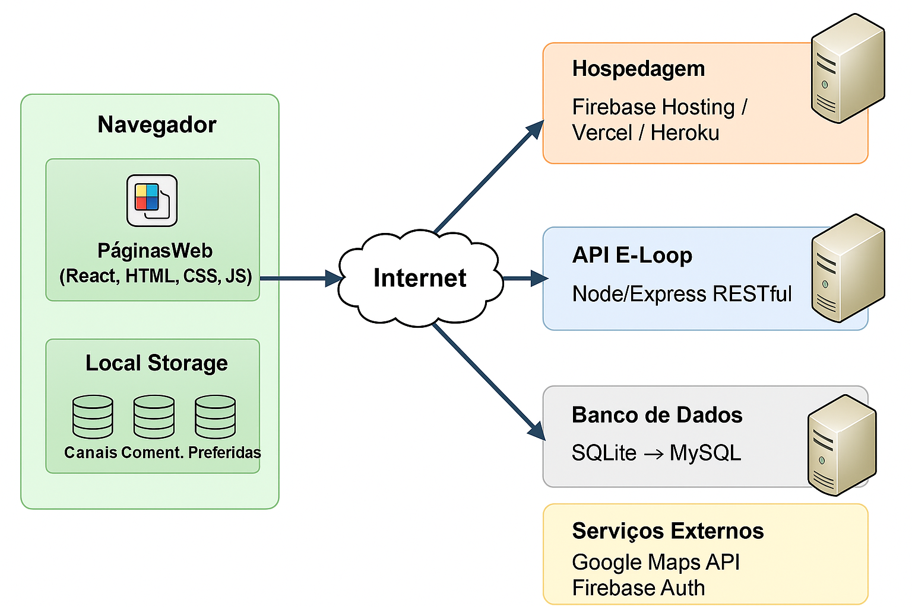
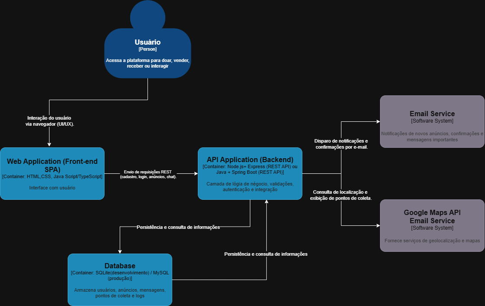
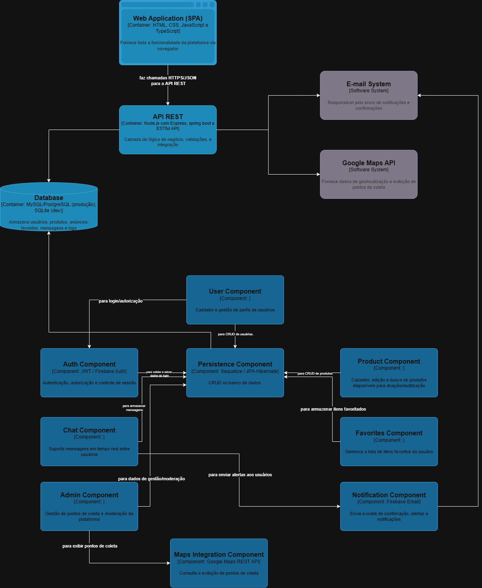
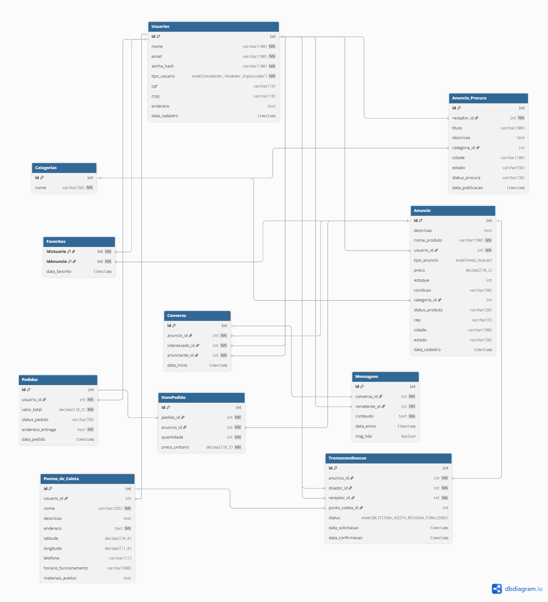

# 3 Modelagem e diagramas arquiteturais: (Modelo C4)

    
  Figura 1: Visão Geral da Solução (camadas)

Esse diagrama apresenta a arquitetura geral do sistema E-Loop. O usuário acessa a aplicação por meio do navegador, onde as páginas web desenvolvidas em React, HTML, CSS e JavaScript são exibidas. No próprio navegador, há também o Local Storage, utilizado para armazenar preferências locais, como canais e comentários preferidos. Pela internet, a aplicação se conecta a diferentes serviços: a hospedagem do sistema (em plataformas como Firebase Hosting, Vercel ou Heroku), a API E-Loop, construída em Node.js/Express no padrão RESTful, e o banco de dados, que inicialmente utiliza SQLite e pode evoluir para MySQL. Além disso, o sistema integra serviços externos, como a API do Google Maps para geolocalização e o Firebase Auth para autenticação dos usuários. Dessa forma, o diagrama mostra como frontend, backend, banco de dados e serviços externos se conectam para viabilizar a aplicação.

## 3.1 Nível 1: Diagrama de Contexto

    
  Figura 2: Diagrama de Contexto  (fonte: https://c4model.com/)

O diagrama de contexto do E-Loop apresenta uma visão geral da plataforma, destacando a interação entre os principais atores, o sistema central e os serviços externos. O E-Loop funciona como uma plataforma de brechó online, conectando doadores, consumidores, ONGs e administradores. Os doadores cadastram itens para doação ou venda, os consumidores buscam e solicitam produtos, as ONGs recebem doações e apoiam na logística, enquanto os administradores gerenciam e mantêm o funcionamento da aplicação. Para garantir a operação, o sistema integra-se a serviços externos, como o Firebase Authentication para autenticação e segurança, um banco de dados para armazenamento de informações, a API do Google Maps para fornecer localização de pontos de coleta e serviços de hospedagem como Heroku, Vercel ou Firebase Hosting, que disponibilizam a aplicação na web. Esse diagrama evidencia de forma simples como pessoas e sistemas interagem com o E-Loop, oferecendo uma visão clara e acessível da paisagem do sistema.

## 3.2 Nível 2: Diagrama de Contêiner

   
  Figura 3 – Diagrama de Contêiner  (fonte: https://c4model.com/)

O diagrama da Figura 3 mostra como a plataforma E-Loop é organizada. As pessoas acessam o sistema pela aplicação web, onde conseguem se cadastrar, anunciar produtos ou procurar itens disponíveis. Essa aplicação conversa com a API, que é responsável por cuidar das regras do sistema e organizar as informações. Todos os dados ficam guardados no banco de dados, como os cadastros, os anúncios e as mensagens trocadas. Além disso, a API se conecta a dois serviços externos: o serviço de e-mail, que envia notificações e confirmações automáticas, e a Google Maps API, que ajuda a mostrar pontos de coleta e localizar usuários próximos. Assim, o diagrama apresenta de forma simples como as partes da plataforma se conectam para funcionar de maneira integrada.

## 3.3 Nível 3: Diagrama de Componentes

   
  Figura 4 – Diagrama de Componentes  (fonte: https://c4model.com/)

O diagrama representa a arquitetura de um sistema web para doação e reutilização de produtos. A plataforma é acessada por uma aplicação SPA, que se comunica com a API REST responsável pela lógica de negócio, validações e integrações. Os dados são armazenados em um banco relacional, que concentra informações sobre usuários, produtos, favoritos, mensagens e pontos de coleta. O backend é composto por componentes específicos: autenticação e autorização, cadastro de usuários, gerenciamento de produtos e favoritos, chat em tempo real, administração da plataforma e integração com mapas para exibir pontos de coleta. Além disso, o sistema envia notificações e confirmações por e-mail, integrando-se a serviços externos como o Firebase Email e a Google Maps API. Dessa forma, a solução garante autenticação segura, gerenciamento de informações, comunicação entre usuários e suporte à geolocalização.

## 3.4 Nível 4: Código

    
  Figura 5 – Diagrama de Entidade Relacionamento (ER) - fonte: https://dbdiagram.io/home

O diagrama representa o modelo de dados de uma plataforma de doação e reutilização de produtos, onde usuários podem cadastrar itens (produto) e vinculá-los a anúncios, imagens e pontos de coleta. Também é possível registrar produtos desejados, facilitando a correspondência entre oferta e demanda. A comunicação entre os participantes ocorre por meio de chats, que armazenam mensagens trocadas individualmente ou em grupo. Dessa forma, o modelo organiza informações essenciais de usuários, produtos, anúncios, pontos de coleta e interações, garantindo suporte às principais funcionalidades do sistema.
